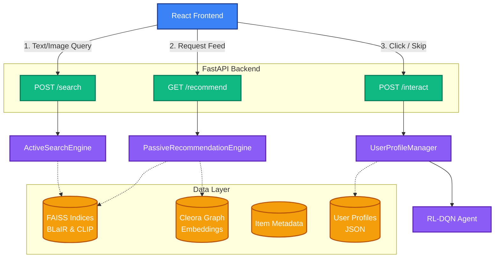
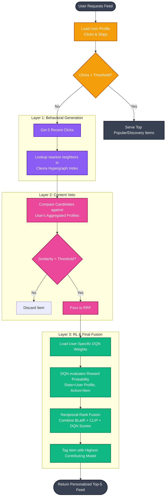
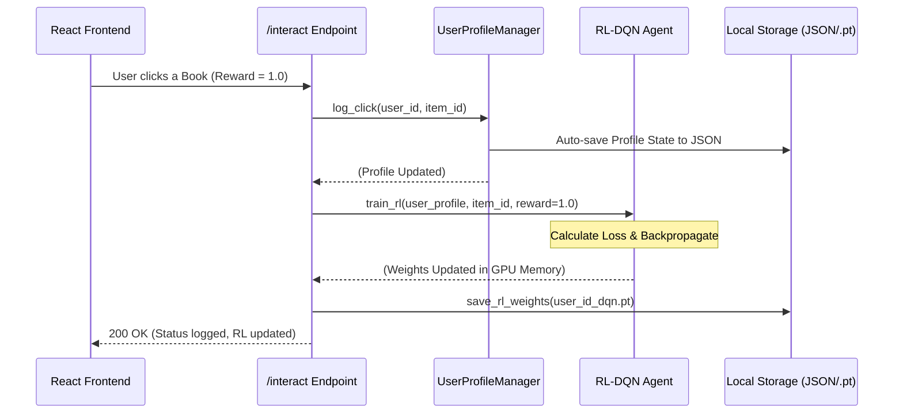

# NBA Multimodal Recommendation System Pipeline

This document contains Mermaid diagrams illustrating the execution pipeline of your DATN project. You can share these with your teacher to explain the system architecture.

## 1. High-Level Architecture & User Actions

This diagram shows how the frontend interacts with the FastAPI backend across the three main flows: Active Search, Passive Recommendations, and Profile Interactions.

---

## 2. Passive Recommendation Timeline (The 3-Layer NBA Funnel)

This is the most complex part of your system—the 3 layers of AI filtering that generate the personalized feed.

---

## 3. Real-time Reinforcement Learning (RL) Loop

How the system learns from user behavior in real-time without restarting.

