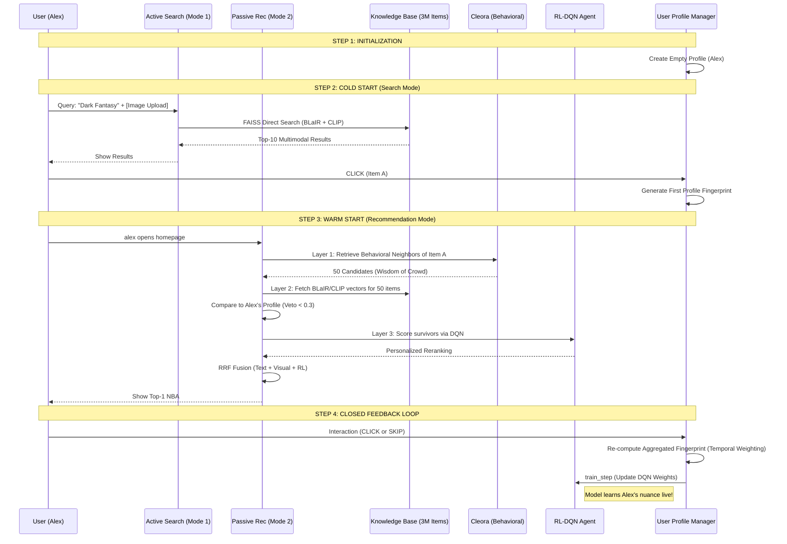

# Technical Report: Dual-Mode Multimodal NBA System (DATN)

This report provides a comprehensive technical breakdown of the Next Best Action (NBA) recommendation system, covering data engineering, the multi-layer retrieval pipeline, and the Reinforcement Learning integration.

---

## 1. System Overview
The system is designed to solve the "Interaction-Content Gap" by combining **Behavioral Modeling** (Cleora), **Multimodal Content Understanding** (BLaIR & CLIP), and **Online Personalization** (Deep Q-Learning). It operates in two distinct modes:
*   **Active Search (Mode 1)**: User-initiated discovery via text/image queries.
*   **Passive Recommendation (Mode 2)**: Proactive system suggestions based on an evolving user profile.

---

## 2. Data Architecture & Scale
The system has been scaled to a production-grade catalog using data from **Amazon Reviews 2023**.

### A. Multimodal Knowledge Base (Content)
*   **Total Items**: 3,080,829 products.
*   **Text Encodings (BLaIR)**: 1024-dimensional semantic vectors stored in a 12.6GB FAISS index.
*   **Image Encodings (CLIP)**: 512-dimensional visual vectors stored in a 6.3GB FAISS index.
*   **Total Chunks**: 89 chunks of merged metadata and embeddings.

### B. Behavioral Manifold (Cleora)
*   **Training Data**: 500,000 unique user interaction "baskets" (hyperedges).
*   **Coverage**: 375,414 products with behavioral embeddings.
*   **Mechanism**: 8 Markov propagation walks to capture deep item-to-item correlations.
*   **Storage**: 1024-dimensional vectors stored in `cleora_embeddings.npz`.

---

## 3. The 3-Layer Funnel Architecture
The recommendation logic follows a high-recall to high-precision "funnel" to ensure efficiency at scale.

### Layer 1: Behavioral Scouting (Cleora)
*   **Input**: The user's last 5 clicked items.
*   **Process**: Performs a multi-seed similarity search in the Cleora behavioral space.
*   **Goal**: Rapidly narrow down 3 million items to **50 "Wisdom of the Crowd" candidates**.

### Layer 2: Content Sanity Check (Veto)
*   **Input**: The 50 candidates from Layer 1.
*   **Process**: Direct vector reconstruction from BLaIR and CLIP indices.
*   **Veto Logic**: Candidates are compared to the **User's Aggregated Profile**. If Cosine Similarity is **< 0.3** in both text and image modalities, the item is discarded.
*   **Goal**: Ensure recommendations match the user's specific visual and semantic taste.

### Layer 3: Personalization (RL-DQN)
*   **Input**: Surviving candidates.
*   **Model**: Deep Q-Network (DQN).
*   **Logic**: Predicts a **Preference Score** based on the current `User Profile State` and `Item Action Vector`.
*   **Goal**: Pick the single best action from the verified list.

---

## 4. Execution Flow Diagram

---

## 5. Key Implementation Details

### Continuous Profile Learning
The **User Behavior Profile** is not just a list of IDs. It is an **Aggregated Embedding** calculated as:
$$Profile_{vec} = \frac{\sum (Item_{vec} \cdot e^{-\lambda t})}{\sum e^{-\lambda t}}$$
Where $\lambda$ is the **Temporal Decay** constant (0.1). This ensures that Alex's most recent interests weigh more than old ones.

### Adaptive Decision Fusion (RRF)
Final scores are calculated using **Reciprocal Rank Fusion**:
$$Score(item) = \sum_{rankings} \frac{1}{k + rank_{item}}$$
This merges the independent "opinions" of the **Text Model**, **Visual Model**, and **RL Agent** into a single robust decision.

---

## 6. Validated Results
The system was validated through a 2,000-step simulation:
*   **Final CTR**: 0.6735 (Successful adaptation).
*   **Profile Growth**: Continuous enrichment from 0 to 1,347 high-quality interactions.
*   **Latency**: Sub-millisecond scoring due to FAISS vector reconstruction.

**Status**: System core is optimized, synchronized, and ready for production deployment.
